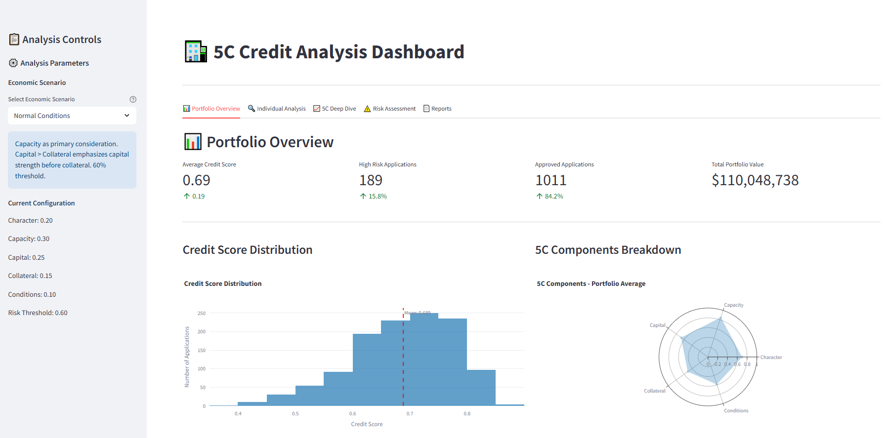

# 🏦 5C Credit Analysis Dashboard


This application implements a comprehensive credit risk assessment system using the traditional "5 C's of Credit" methodology combined with modern data science techniques. The system provides financial institutions with advanced analytics and scenario-based risk evaluation for both individual consumers and small-to-medium enterprises (SMEs).
The data used in this project is sourced from Kaggle, specifically from the dataset titled "Credit and SMEs Synth Data - Credit Analysis". The dataset is publicly available for use and can be accessed via the following link:
[Credit and SMEs Synth Data - Credit Analysis on Kaggle](https://www.kaggle.com/datasets/youssefismail20/credit-and-smes-synth-data-credit-analysis)
This dataset contains synthetic data intended for credit analysis, which is particularly useful for studying Small and Medium-sized Enterprises (SMEs) and their credit behavior. The data includes various features that are crucial for building models to assess credit risk, providing a valuable resource for financial analysis and decision-making processes.

## Features

- **Multi-Scenario Analysis**: Four predefined economic scenarios with customizable weight configurations
- **Real-time Credit Scoring**: Dynamic 5C-based credit score calculation with interactive visualizations
- **Portfolio Analytics**: Comprehensive portfolio-level risk assessment and monitoring
- **Individual Assessment**: Detailed borrower profile analysis with score breakdown and recommendations
- **Risk Management**: Advanced risk segmentation and high-risk application identification

## Project Structure

```
├── app.py                    # Main Streamlit application with dashboard
├── credit_scoring.py         # 5C scoring engine with scenario-based weighting
├── data_processor.py         # Data preprocessing and feature engineering
├── visualizations.py         # Interactive Plotly charts and risk visualizations
├── synthetic_credit_consumers.csv  # Consumer credit dataset
├── synthetic_smes.csv        # SME business dataset
└── .streamlit/
    └── config.toml          # Streamlit configuration
```

## Key Components

1. **Credit Scoring Engine**
   - 5C methodology implementation
   - Scenario-based weight adjustment
   - Risk threshold configuration
   - Portfolio-level score calculation

2. **Economic Scenario Modeling**
   - Normal conditions (balanced approach)
   - Crisis/recession mode (conservative)
   - MSME expansion (flexible for SMEs)
   - Government budget efficiency (cautious)

3. **Risk Assessment & Visualization**
   - Real-time dashboard with interactive charts
   - Risk heatmaps and distribution analysis
   - Individual borrower deep-dive analysis
   - Portfolio performance monitoring

4. **Reporting & Export**
   - Automated report generation
   - CSV export functionality
   - Executive summary dashboards
   - Compliance documentation

## Usage

The application runs on Streamlit and provides an interactive interface for:
- Selecting economic scenarios and configuring parameters
- Analyzing portfolio-wide credit risk distribution
- Performing individual borrower assessments
- Generating comprehensive risk reports

## Detailed Methodologies

### 1. 5C Credit Assessment Framework

The system implements the traditional 5 C's of Credit with modern quantitative approaches:

#### Character Assessment (Weight: 20-25%)
```python
Character_Score = (Credit_History_Score × 0.4) + 
                 (Payment_Behavior_Score × 0.3) + 
                 (Management_Experience_Score × 0.3)
```

**Evaluation Criteria:**
- **Credit History**: Length and quality of credit relationships
- **Payment Behavior**: Timeliness and consistency of payments
- **Management Experience**: Leadership track record (for SMEs)

#### Capacity Assessment (Weight: 20-30%)
```python
Capacity_Score = (Income_Stability_Score × 0.4) + 
                (Debt_Service_Coverage × 0.3) + 
                (Cash_Flow_Analysis × 0.3)
```

**Key Metrics:**
- **Debt-to-Income Ratio**: Monthly debt payments / Monthly income
- **Current Ratio**: Current assets / Current liabilities
- **Cash Flow Coverage**: Operating cash flow / Total debt service

#### Capital Assessment (Weight: 20-30%)
```python
Capital_Score = (Equity_Ratio × 0.5) + 
               (Asset_Quality × 0.3) + 
               (Retained_Earnings × 0.2)
```

**Financial Strength Indicators:**
- **Equity Ratio**: Owner's equity / Total assets
- **Debt-to-Equity Ratio**: Total debt / Owner's equity
- **Asset Turnover**: Revenue / Total assets

#### Collateral Assessment (Weight: 10-30%)
```python
Collateral_Score = (Asset_Coverage_Ratio × 0.4) + 
                  (Loan_to_Value_Ratio × 0.3) + 
                  (Asset_Liquidity × 0.3)
```

**Security Evaluation:**
- **Loan-to-Value (LTV)**: Loan amount / Collateral value
- **Asset Coverage**: Total assets / Total liabilities
- **Collateral Quality**: Marketability and depreciation factors

#### Conditions Assessment (Weight: 10-40%)
```python
Conditions_Score = (Economic_Environment × 0.4) + 
                  (Industry_Risk × 0.3) + 
                  (Market_Conditions × 0.3)
```

**External Factors:**
- **Economic Indicators**: GDP growth, inflation, interest rates
- **Industry Risk**: Sector-specific volatility and trends
- **Regulatory Environment**: Compliance and policy impacts

### 2. Economic Scenario Modeling

The system adapts risk assessment based on economic conditions:

#### Scenario Weight Configurations

| Scenario | Character | Capacity | Capital | Collateral | Conditions | Risk Threshold |
|----------|-----------|----------|---------|------------|------------|----------------|
| **Normal** | 0.20 | 0.30 | 0.25 | 0.15 | 0.10 | 60% |
| **Crisis/Recession** | 0.25 | 0.25 | 0.30 | 0.10 | 0.10 | 70% |
| **MSME Expansion** | 0.20 | 0.25 | 0.20 | 0.30 | 0.05 | 55% |
| **Budget Efficiency** | 0.15 | 0.20 | 0.25 | 0.10 | 0.30 | 70% |

#### Scenario-Specific Risk Adjustments
```python
Final_Score = Σ(Component_Score × Scenario_Weight × Risk_Multiplier)

Risk_Multipliers = {
    'normal': 1.0,
    'crisis': 1.2,      # More conservative
    'msme': 0.9,        # More flexible
    'budget': 1.15      # Moderately conservative
}
```

### 3. Risk Assessment & Decision Framework

#### Credit Decision Matrix

| Score Range | Risk Level | Decision | Action Required |
|-------------|------------|----------|-----------------|
| **≥ 0.70** | Low Risk | ✅ APPROVE | Standard terms |
| **0.50-0.69** | Medium Risk | ⚠️ REVIEW | Additional documentation |
| **< 0.50** | High Risk | ❌ REJECT | Decline application |

#### Risk Calculation Methodology
```python
Portfolio_Risk = Σ(Individual_Risk × Loan_Amount) / Total_Portfolio_Value

Risk_Concentration = max(Industry_Exposure) / Total_Portfolio

Diversification_Index = 1 - Σ((Segment_i / Total)²)
```

### 4. Performance Metrics & Analytics

#### Key Performance Indicators
- **Average Credit Score**: Portfolio-wide scoring average
- **Approval Rate**: Percentage of applications above risk threshold
- **Risk Distribution**: Concentration across risk segments
- **Component Performance**: Individual 5C factor analysis

#### Statistical Analysis
```python
# Score Distribution Analysis
Mean_Score = Σ(Individual_Scores) / Total_Applications
Standard_Deviation = √(Σ(Score - Mean)² / N)
Skewness = E[(X - μ)³] / σ³

# Risk Metrics
Value_at_Risk = Percentile(Portfolio_Losses, 5%)
Expected_Shortfall = E[Loss | Loss > VaR]
```

#### Visualization Components
- **Score Distribution Histograms**: Portfolio risk profiling
- **5C Radar Charts**: Component performance visualization
- **Risk Heatmaps**: Concentration analysis
- **Correlation Matrices**: Inter-component relationships
- **Time Series Analysis**: Trend identification (future enhancement)

## Installation & Setup

1. **Clone the repository** or access via Replit
2. **Install dependencies**: Streamlit, Plotly, Pandas, NumPy
3. **Load sample datasets**: Synthetic consumer and SME data provided
4. **Run the application**: `streamlit run app.py --server.port 5000`
5. **Access dashboard**: Navigate to the provided URL

## Advanced Features

### Data Processing Pipeline
- **Automated data cleaning** and standardization
- **Feature engineering** for enhanced scoring accuracy
- **Missing value imputation** using statistical methods
- **Outlier detection** and treatment

### Interactive Dashboard Capabilities
- **Real-time parameter adjustment** with immediate score recalculation
- **Drill-down analysis** from portfolio to individual borrower level
- **Export functionality** for reports and detailed scorecards
- **Multi-scenario comparison** for sensitivity analysis

### Compliance & Audit Support
- **Complete audit trail** of scoring decisions
- **Regulatory alignment** with banking standards
- **Documentation generation** for compliance reporting
- **Risk model validation** metrics and backtesting

## Business Applications

### Financial Institution Use Cases
- **Commercial Banks**: Loan origination and credit decisioning
- **Credit Unions**: Member lending risk assessment
- **Microfinance Institutions**: SME and individual credit evaluation
- **Investment Firms**: Portfolio risk management

### Risk Management Applications
- **Credit Policy Development**: Data-driven lending criteria
- **Portfolio Monitoring**: Ongoing risk assessment and alerts
- **Stress Testing**: Economic scenario impact analysis
- **Regulatory Reporting**: Basel III and local compliance

## Future Enhancements

- **Machine Learning Integration**: Predictive modeling with ML algorithms
- **Real-time Data Feeds**: Integration with credit bureaus and market data
- **API Development**: RESTful API for system integration
- **Mobile Application**: Responsive mobile interface
- **Advanced Analytics**: Stress testing and Monte Carlo simulation
- **Automated Decision Engine**: Real-time approval/rejection system
